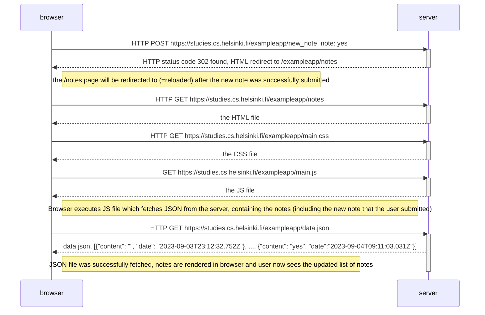

```mermaid
sequenceDiagram
    participant browser
    participant server

    browser->>server: HTTP POST https://studies.cs.helsinki.fi/exampleapp/new_note, note: yes
    activate server
    server-->>browser: HTTP status code 302 found, HTML redirect to /exampleapp/notes
    deactivate server
    Note right of browser: the /notes page will be redirected to (=reloaded) after the new note was successfully submitted
    
    browser->>server: HTTP GET https://studies.cs.helsinki.fi/exampleapp/notes
    activate server
    server-->>browser: the HTML file
    deactivate server

    browser->>server: HTTP GET https://studies.cs.helsinki.fi/exampleapp/main.css
    activate server
    server-->>browser: the CSS file
    deactivate server
    
    browser->>server: GET https://studies.cs.helsinki.fi/exampleapp/main.js
    activate server
    server-->>browser: the JS file
    deactivate server
    Note right of browser: Browser executes JS file which fetches JSON from the server, containing the notes (including the new note that the user submitted)
    
    browser->>server: HTTP GET https://studies.cs.helsinki.fi/exampleapp/data.json
    activate server
    server-->>browser: data.json, [{"content": "", "date": "2023-09-03T23:12:32.752Z"}, ..., {"content": "yes", "date":"2023-09-04T09:11:03.031Z"}]
    Note right of browser: JSON file was successfully fetched, notes are rendered in browser and user now sees the updated list of notes
    deactivate server    

```
