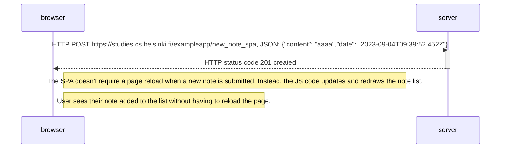

```mermaid
sequenceDiagram
    participant browser
    participant server

    browser->>server: HTTP POST https://studies.cs.helsinki.fi/exampleapp/new_note_spa, JSON: {"content": "aaaa","date": "2023-09-04T09:39:52.452Z"}
    activate server
    server-->>browser: HTTP status code 201 created
    deactivate server
    Note right of browser: The SPA doesn't require a page reload when a new note is submitted. Instead, the JS code updates and redraws the note list.
    Note right of browser: User sees their note added to the list without having to reload the page.
```
